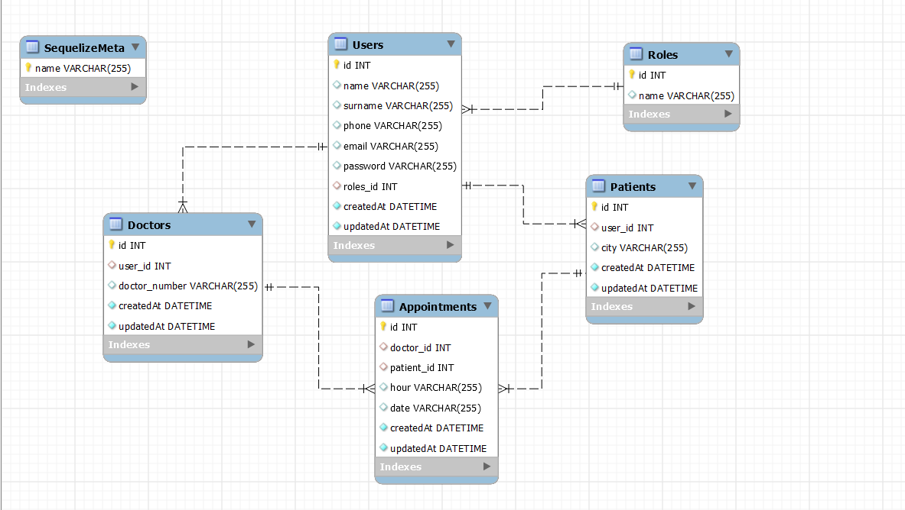

# Backend-Clinica-Dental

<details>
  <summary>Contenido 📝</summary>
  <ol>
    <li><a href="#sobre-el-proyecto">Sobre el proyecto</a></li>
    <li><a href="#Tecnologias-utilizadas">Tecnologias utilizadas</a></li>
    <li><a href="#diagrama-bd">Diagrama</a></li>
    <li><a href="#instalación-en-local">Instalación</a></li>
    <li><a href="#endpoints">Endpoints</a></li>
  </ol>
</details>

## Sobre el proyecto
Este proyecto requería una API funcional, para una clinica dental, conectada a una base de datos con al menos una relación de uno a muchos y una relación de muchos a muchos, donde puedes registrarte, loguearte y hacer citas con el doctor.

## Tecnologias utilizadas


## Diagrama BD
</img>

## Instalación en local
1. Clonar el repositorio
2. ` $ npm install ` para instalar las dependencias.
3. Conectamos nuestro repositorio con la base de datos en el config.json
4. Creamos la base de datos con ``` $ npx sequelize-cli db:create```
5. Ejecutamos las migraciones con: ``` $ npx sequelize-cli db:migrate ``` 
6. Ejecutamos los seeders con: ``` $ npx sequelize-cli db:seed:all ``` 
7. Para iniciar el servidor:  ``` $ npm run dev ```

## Endpoints
<details> -->
<summary>Endpoints</summary>

- AUTH
    - REGISTER

            POST http://localhost:4000/register
        body:
        ``` js
            {
                "name": "David",
                "surname": "Garcia",
                "phone": "111222333",
                "email": "david@david.com",
                "password": "princes"
            }
        ```

    - LOGIN

            POST http://localhost:4000/login  
        body:
        ``` js
            {
                "email": "david@david.com",
                "password": "princes"
            }
        ```

    - New Appointment

            POST http://localhost:4000/appointment  
            body:
        ``` js
            {
                "hour": "20:00",
                "date": "12/1/2012"
            }
        ```

    - Update Appointment

            UP http://localhost:4000/appointment
        body:
        ``` js
            {
                "hour": "10:00",
                "date": "13/2/2023"
            }
        ```

    - Profile

            POST http://localhost:4000/profile 

   - Update Profile

            UP http://localhost:4000/updateprofile
        body:
        ``` js
            {
                "name":"david",
                "surname":"perez",
                "phone":"333444111",
                "email":"david@david.com",
                "password":"banana"
            }
        ```

    - Get Users

            GET http://localhost:4000/adminuser

    - Get Appointment

            GET http://localhost:4000/adminappointments

   - Create Role

            POST http://localhost:4000//admin-createrol
        body:
        ``` js
            {
                "name": "paciente"
            }
        ```

   - Update Role

            POST http://localhost:4000/admin-updaterol
        body:
        ``` js
             {
                "name": "paciente"
            }
        ```

   - Delete Appointment

            UP http://localhost:4000/admin-deleterol
        body:
        ``` js
            {
                "name": "paciente"
            }
        ```

   - Get all Role

            UP http://localhost:4000/admin-deleterol


</details>